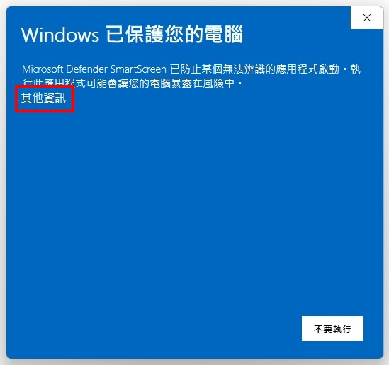

# Fluffy Desk

Q 彈、療癒的桌面小寵物，在你螢幕上吃糖、打瞌睡、追游標、互相依偎。(\*´ω\`)人(´ω`\*)

<video src="https://github.com/Codfisher/fluffy-desk/raw/main/assets/interact-with-the-mouse.mp4" controls width="100%"></video>

## 特點

- **不打擾工作** — 全透明、無焦點、滑鼠穿透，永遠在最上層但不擋畫面
- **有個性** — AI 狀態機驅動，主動找掉落物、追游標玩
- **跨平台** — Windows、macOS（Apple Silicon + Intel）

## 遊玩機制

CPU 與滑鼠等活動會累積能量，特定手勢可觸發掉落物：

- **小碎屑** — 左右甩滑鼠掉出，小動物會收集或吃掉補體力

    <video src="https://github.com/Codfisher/fluffy-desk/raw/main/assets/eat.mp4" controls width="100%"></video>

- **中糖粒** — 滑鼠畫圈消耗能量後掉出糖粒，小動物會搬回巢穴

    <video src="https://github.com/Codfisher/fluffy-desk/raw/main/assets/hauling.mp4" controls width="100%"></video>

小動物會跟滑鼠或夥伴互動，更多行為等你來發掘！੭ ˙ᗜ˙ )੭

## 安裝

至 [Releases](https://github.com/Codfisher/fluffy-desk/releases/latest) 選擇對應平台檔案下載：

- **Windows** → 檔名為 `Fluffy-Desk-x.y.z-Setup.exe` 的安裝檔
- **macOS** → 檔名含 `darwin-arm64`（Apple Silicon）或 `darwin-x64`（Intel）的 zip

### Windows

1. 下載 `Fluffy-Desk-x.y.z-Setup.exe`，雙擊執行。
2. Windows SmartScreen 會跳出「**Windows 已保護您的電腦**」藍色警告。本應用尚未購買程式碼簽章憑證，Windows 預設會擋下；原始碼公開於 [GitHub](https://github.com/Codfisher/fluffy-desk)，歡迎自行審查。點「**更多資訊**」→「**仍要執行**」繼續安裝。

    

3. 安裝完成會在開始選單建立捷徑並自動啟動。

> **自動更新**：背景發現新版會自動下載，下次關閉應用時靜默安裝。也可右鍵點系統匣（右下角小圖示）打開選單 → 選「**檢查更新**」立刻檢查；手動檢查到新版下載完成會跳通知，3 秒後自動重啟安裝。

### macOS

依機器晶片選對應壓縮檔下載：

- **Apple Silicon**（M1 / M2 / M3 / M4）→ 檔名含 `darwin-arm64` 的 zip
- **Intel** → 檔名含 `darwin-x64` 的 zip

> 不確定晶片？點左上角  圖示 → 「關於這台 Mac」，查看「晶片」或「處理器」欄位。也可開「終端機」執行 `uname -m`：`arm64` 即 Apple Silicon、`x86_64` 即 Intel。

1. 解壓後將 `Fluffy Desk.app` 拖入 **`/Applications`（系統應用程式資料夾）**。若拖到 `~/Applications`（家目錄），請把下方方式 A 指令中的 `/Applications` 改為 `~/Applications`。
2. 第一次執行 macOS 會擋下，提示「無法打開，因為無法驗證開發者」。任選一種放行：
   - **方式 A（推薦・終端機一行搞定）**：先確認 `Fluffy Desk.app` 已在 `/Applications` 裡，再開「**終端機**」貼下列指令按 Enter，之後雙擊不會再被擋。

     ```bash
     xattr -d com.apple.quarantine "/Applications/Fluffy Desk.app"
     ```

   - **方式 B（GUI・macOS 15 Sequoia 及之後）**：對話框只有「**完成**」「**丟到垃圾桶**」兩顆按鈕，沒有「打開」。先點「**完成**」關掉（**別點「丟到垃圾桶」**），再到「**系統設定 → 隱私權與安全性**」捲到底，找 Fluffy Desk 那一條按「**強制打開**」（macOS 版本不同可能寫「仍要打開」或「Open Anyway」）。
   - **方式 C（GUI・macOS 14 Sonoma 及之前）**：在 Finder 對 `Fluffy Desk.app` **右鍵點**（或 `Control` + 點 / 兩指輕點）→ 選「**打開**」→ 對話框按「**打開**」。

> **自動更新**：發現新版會跳系統通知，點通知會直接開你的架構下載頁（若該版本沒出你的架構，會帶到 release 列表，自行挑檔即可）。也可在選單列（螢幕右上方）點應用圖示打開選單 → 選「**檢查更新**」手動檢查。
>
> ⚠️ **每次更新後 macOS 會再擋一次**：新版 `Fluffy Desk.app` 是新檔案，macOS 會重新標上 quarantine 隔離屬性（防惡意軟體機制），跟舊版「已放行」狀態無關。請再走一次上方任一放行步驟（建議記下方式 A 的 `xattr` 指令，更新後貼一次即可）。

### 啟動後

- 安裝完成後麻糬會自動出現在桌面，全透明、不擋滑鼠。
- **Windows**：工作列右下角系統匣可找到 Fluffy Desk 圖示，右鍵點開選單（檢查更新、關閉程式等）。
- **macOS**：螢幕右上方選單列可找到 Fluffy Desk 圖示，左鍵或右鍵點開選單。

### 系統需求

- Windows 10 / 11（x64）
- macOS 12 Monterey 以上

### 解除安裝

- **Windows**：「設定 → 應用程式 → 已安裝的應用程式」搜尋 Fluffy Desk，按解除安裝。
- **macOS**：將 `/Applications` 中的 `Fluffy Desk.app` 拖到垃圾桶即可。
